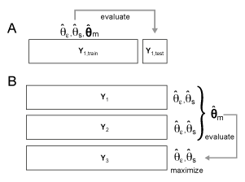

.. _fitting:

Model Fitting
=============
Models can be either fit to individual or to group data. For group fits, some or all of the model parameters are shared across the group, while the noise and scale parameters are still fitted individually to each subject. To compare models of different complexity, we have implemented two types of crossvalidation, either within individuals across partitions, or across individuals

.. _Figure_crossval:

    **Model crossvalidation schemes.** (**A**) *Within-subject crossvalidation where the model is fit on N-1 partitions and then evaluated on the left-out partition N.* (**B**) *Group crossvalidation were the model is fit to N-1 subjects and then evaluated on a left-out subject. For group crossvalidation, individual scaling and noise parameters are fit to each subject to allow for different signal-to-noise levels.*

.. _fitting_individual:

Fitting to individual data sets
-------------------------------
Models can be fitted to each data set individually, using the function ``fit_model_individ``. Individual fitting makes sense for models with a single component (fixed models), which can be evaluated without crossvalidation.

.. sourcecode:: python

   Y = [Dataset1, Dataset2, Dataset3, ...]
   M = [Model1, Model2, ...]
   T, theta = pcm.inference.fit_model_individ(Y, M, ...)

A number of input options can be specified as well:

* ``run_effect``: Determines the modelling of the within-partition covariance. This is especially important for fMRI data, where activation estimates within a partition (imaging run) are usually correlated, as they are measured relative to the same baseline. The partition effect can be either included as a ``fixed`` effect, in which case it is simply subtracted out. However, by specifying it as a fixed effect, the algorithm correctly takes the subtraction into account when fitting the model. If the run-effect is set to ``random``, the covariance will be modelled together with the model parameter. If it is set to ``none`` the run effect is ignored.

* ``fit_scale``: Determines whether a scale parameter is fit for each subject, which determines the amount of signal variance. This should be done at least for fixed models. To ensure that the scale parameter is positive, the routine fits the log of the scale paramter, such that the resulting signal has a covariance matrix of :math:`\mathbf{G}(\boldsymbol{\theta_m} exp(\theta_s)`. For component (and other) models that usually also model the signal strength, the additional scale parameter introduces some redundancy. For this reason we impose a log-normal prior forcing the scale parameter to be close to 1. The variance of this prior can be adjusted with through the option ``scale_prior`` and is set to 1000 by default.

* ``noise_cov``: Here you can optionally specify a covariance structure of the noise. For fMRI data, a useful approach is to use the estimate from the first-level model, which is related to the structure of the design :math:`(\mathbf{X}^T\mathbf{X})^{-1}`. Together with the option ``run_effect``, this input will determine your \ref{Noisemodel}.

The output ``T`` is a pandas data frame that is hierarchically organised.

.. sourcecode:: python

   T.likelihood['Model1'] # Log-likelihood of each data set under model 1
   T.likelihood['Model2'] # Log-likelihood of each data set under model 2
   ...
   T.noise['Model1']      # Noise parameter value
   ...
   T.scale['Model1']      # Scale parameter values (exp(theta_scale))
   ...
   T.iterations['Model1'] # Number of iterations until convergence
   ...

The output ``theta`` is a list of np-arrays, which contain the ``M.n_param`` model parameters, the log-scale and log-noise parameter for each data set.

The output can be used to compare the likelihoods between different models. Alternatively you can inspect the individual fits by looking at the parameters (theta). The predicted second moment matrix for any model can be obtained by

.. sourcecode::python

   G,_ = M[0].predict(theta[0][:M[0].n_param])
   plt.imshow(G)

Fitting to individual data sets with cross-validation across partitions
-----------------------------------------------------------------------

Crossvalidation within subject is the standard for encoding models and can also be applied to PCM-models.

.. sourcecode:: python

   T, theta = pcm.inference.fit_model_individ(Y, M, ...)

.. _fitting_group:

Fitting to group data sets
--------------------------

The function ``fit_model_group`` fits a model to a group of subjects. By default, all parameters that change the **G** matrix, that is ``theta[0:M.n_param]`` are shared across all subjects. To account for the individual signal-to-noise level, by default a separate signal strength and noise parameter(s) are fitted for each subject. For each individual subject, the predicted covariance matrix of the data is:

.. math::
    {\bf{V}_i}=\theta_s \bf{ZG(\theta_m)Z^{T}+S(\theta_{\epsilon})

To finely control, which parameters are fit commonly to the group and which ones are fit individually, one can set the boolean vector ``M[m].common_param``, indicating which parameters are fit to the entire group. The output `theta` for each model contains now a single vector of the common model parameters, followed by the data-set specific parameters: possibly the non-common model parameters, and then scale and noise parameters.

.. sourcecode:: python

   Y = [Dataset1, Dataset2, Dataset3, ...]
   M = [Model1, Model2, ...]
   T, theta = pcm.inference.fit_model_group(Y, M, ...)

Fitting to group data sets with cross-validation across participants
--------------------------------------------------------------------

PCM allows also between-subject crossvalidation (see panel b). The common model parameters that determine the representational structure are fitted to all the subjects together, using separate noise and scale parameters for each subject. Then the model is evaluated on the left-out subjects, after maximizing scale and noise parameters (and possibly non-common model parameters). The Function ``fit_model_group_crossval`` implements these steps.

The demo ``demo_finger.ipynb`` provides a full example how to use group crossvalidation to compare different models. Three models are being tested: A muscle model, a usage model (both a fixed models) and a combination model, in which both muscle and usage can be combined in any combination. We also fit the noise-ceiling model, and a null-model. Because the combination model has one more parameter than each single model, crossvalidation is necessary for inferential tests. Note that for the simple models, the simple group fit and the cross-validated group fit are identical, as in both cases only a scale and noise parameter are optimized for each subject.

.. sourcecode:: python

   # Build models from the second momement matrices
   M = []
   M.append(pcm.FixedModel('null',np.eye(5)))
   M.append(pcm.FixedModel('muscle',modelM[0]))
   M.append(pcm.FixedModel('natural',modelM[1]))
   M.append(pcm.ComponentModel('muscle+nat',[modelM[0],modelM[1]]))
   M.append(pcm.FreeModel('ceil',5)) # Noise ceiling model

   # Fit the model in to the full group, using a individual scaling parameter for each
   T_gr, theta = pcm.inference.fit_model_group(Y, M, fit_scale=True)

   # crossvalidated likelihood is the same as the group fit for all
   # except the component and noise ceiling model
   T_cv, theta_cv = pcm.inference.fit_model_group_crossval(Y, M, fit_scale=True)

   # Make a plot, using the group fit as upper, and the crossvalidated fit as a the lower noise ceiling
   ax = pcm.vis.model_plot(T_cv.likelihood,null_model = 'null',noise_ceiling= 'ceil',upper_ceiling = T_gr.likelihood['ceil'])

.. _likelihood:

Likelihood and Optimization
---------------------------

Under the hood, the main work in PCM is accomplished by the routines ``likelihood_individ``, and ``likelihood_group`` (see :ref:`inference`), which return the **negative log-liklihood** of the data under the model, as well as the first (and optionally) the second derivative. This enables PCM to use standard optimization routines, such a ``scipy.optimize.minimize``. For many models, a Newton-Raphson algorithm, implemented in ``pcm.optimize.newton`` provides a fast and stable solution. A custom algorithm for models can be chosen by setting ``M.fit`` to be either a string with a algorithm name that is implemented in PCM, or a function that returns the fitted parameters. (**TO BE IMPLEMENTED**).