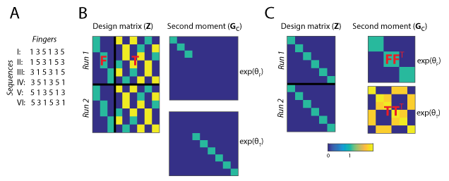

.. _model_encoding_rsa:

Encoding- vs. RSA-style models
==============================
The main intellectual work when using PCM is to build the appropriate models. There are basically two complementary approaches or philosophies when it comes to specifying a representational models. Which way you feel more comfortable with will likely depend on whether you are already familiar with Encoding analysis or RSA. Ultimately, most problems can be formulated in both ways, and the results will be identical. Nonetheless, it is useful to become familiar with both styles of model building, as they can also be combined to find the most  intuitive and computationally efficient way of writing a particular model.

Example
-------
An empirical example for how to construct the same model as either an Encoding- or RSA-style PCM model comes from Yokoi et al. (2018). In this experiment, participants learned six motor sequences, each different permutations of pressing the finger 1, 3, and 5 (see Fig 2a). We would like to model the activity pattern in terms of two model components: In the first component, each finger contributes a specific pattern, and the pattern of the first finger has a particularly strong weight. In the second component, each transitions between 2 subsequent fingers contributes a unique pattern. 

Encoding-style models
--------------------- 
When constructing an encoding-style model, the model components are formulated as sets of features, which are encoded into the design matrix. In our example, the first feature set (first finger) has 3 columns with variables that indicate whether this first finger was digit 1, 3, or 5 (because each finger occurs exactly once in each sequence, we can ignore the subsequent presses). The second feature set has 6 features, indicating which ones of the 6 possible transitions between fingers were present in the sequence. Therefore, the design matrix **Z** has 9 columns (Fig. 2b). The encoding-style model, however, is not complete without a prior on the underlying activity patterns **U**, i.e. the feature weights. As implicit in the use of ridge regression, we assume here that all features within a feature set are independent and equally strongly encoded. Therefore, the second moment matrix for the first model component is an identity matrix of 3x3 and for the second component an identity matrix of size 6x6. Each component then is weighted by the relative weight of the component, :math:`exp(\theta_i)`. The overall second moment matrix **G** then is the sum of the two weighted model component matrices. This model would be equivalent to an encoding model where each of the features sets has its own ridge coefficient. PCM will automatically find the optimal value of the two ridge coefficients (the importance of each feature set). 

    **Figure2.** *(A) Set of six multi-finger sequences used in the task. (B) Encoding-style model construction.The condition matrix Z, here shown for 12 trials of 2 x 6 sequences, contains all features. Featureset* **F** *contains indicators for first fingers in each sequence, and featureset* **T** *contains the finger transitions for each sequence. The second moment matrices for the two feature sets are diagonal matrices, indicating which feature is taken into account. Each feature set is multiplied by an overall importance of the featureset (analogous to the ridge coefficient for the feature set) (C) RSA-style model construction. The design matrix indicates which of the 6 sequences was executed. The second momemnt matrix determines the hypothesized covariances between the 6 sequence patterns. In both cases, the overall second moment matrix* **G** *is the weighted sum of the two component matrices*

RSA-style models
----------------
In RSA, models are specified in terms of the predicted similarity or dissimilarity between discrete experimental conditions. Therefore, when constructing our model in RSA-style, the design matrix **Z** simply indicates which trial belonged to which sequence. The core of the model is specified in the second moment matrix, which specifies the covariances between conditions, and hence both Euclidean and correlation distances (Fig. 2C). For example, the first component predicts that sequence I and II, which both start with digit 1, share a high covariance. The predicted covariances can be calculated from an encoding-stype model by taking the inner product of the feature sets :math:`\mathbf{FF}^{T}`.

Which approach to use?
----------------------
The Models depicted in Fig. 2B and 2C are identical. So when should we prefer one approach over the other? Some of this is up to personal taste. However, some experiments have no discrete conditions. For example, each trial may be also characterized by an action or stimulus property that varied in a continuous fashion. For these experiments, the best way is to formulate the model in an encoding style. Even if there are discrete conditions, the conditions may differ across subjects. Because the group fitting routines (see below) allow for subject-specific design matrices, but not for subject-specific second-moment matrices, encoding-style models are the way to go. In other situations, for example experiments with fewer discrete conditions and many feature sets, the RSA-style formulation can be more straightforward and faster. 

Finally, the two approaches can be combined to achieve the most natural way of expressing models. For example in our example, we used the design matrix from the first finger model Fig. 2B, combined with a second moment derived from the natural statistics to capture the known covariance structure of activity patterns associated with single finger movements Ejaz et al. (2015). 