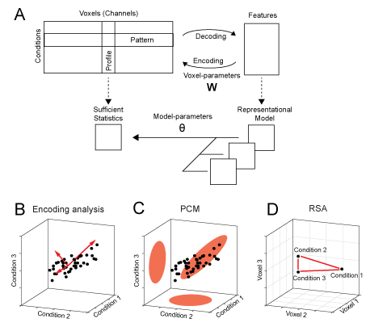

Introduction
------------
The study of brain representations aims to illuminate the relationship between brain activity patterns and "things in the world" - be it objects, actions, or abstract concepts. Understanding the internal syntax of brain representations, and how this structure changes across different brain regions, is essential in  gaining insights into the way the brain processes information.

Central to the definition of representation is the concept of decoding. A feature (i.e. a variable that describes some aspect of the "things in the world") that can be decoded from the ongoing neural activity in a region is said to be represented there. For example, a feature could be the direction of a movement, the orientation and location of a visual stimulus, or the semantic meaning of a word. Of course, if we allow the decoder to be arbitrarily complex, we would use the term representation in the most general sense. For example, using a computer vision algorithm, one may be able to identify objects based on activity in primary visual cortex. However, we may not conclude necessarily that object identity is represented in V1 - at least not explicitly. Therefore, it makes sense to restrict our definition of an explicit representation to features that can be linearly decoded by a single neuron from some population activity (Kriegeskorte & Diedrichsen, 2017, 2019).

While decoding is a popular approach when analyzing multi-variate brain activity patterns, is is not the most useful tool when we aim to make inferences about the nature of brain representations. The fact that we can decode feature X well from region A does not imply that the representation in A is well characterized by feature X - there may be many other features that better determine the activity patterns in this region.

.. _my-figure1:

    **Figure 1.** *Decoding, encoding and representational models.* (**A**) *The matrix of activity data consists of rows of activity patterns for each condition or of columns of activity profiles for each voxel (or more generally, measurement channel). The data can be used to decode specific features that describe the experimental conditions (decoding). Alternatively, a set of features can be used to predict the activity data (encoding). Representational models work at the level of a sufficient statistics (the second moment) of the activity profiles. Models are formulated in this space and possibly combined and changed using higher-order model parameters.* (**B**) *Encoding analysis: The activity profiles of different voxels are points in the space of the experimental conditions. Features in encoding models are vectors that describe the overall distribution of the activity profiles.* (**C**) *PCM: The distribution of activity profiles is directly described using a multivariate normal distribution.* (**D**) *Representational similarity analysis (RSA): plots the activity patterns for different conditions in the space defined by different voxel. The distances between activity patterns serves here as the sufficient statistic, which is fully defined by the second moment matrix.*

In an Encoding model, we characterize how well we can explain the activities in a specific region using a sets of features. The activity profile of each voxel (here shown as columns in the activity data matrix), is modeled as the linear combination of a set of features (Fig. 1a). Each voxel, or more generally measurement channel, has its own set of parameters (:math:`\mathbf{W}`) that determine the weight of each feature. This can visualized by plotting the activity profile of each voxel into the space spanned by the experimental conditions (Fig. 1b). Each dot refers to the activity profile of a channel (here a voxel), indicating how strongly the voxel is activated by each condition. Estimating the weights is equivalent to a projection of each of the activity profiles onto the feature vectors. The quality of the model can then be evaluated by determining how well unseen test data can be predicted. When estimating the weights, encoding models often use some form of regularization, which essentially imposes a prior on the feature weights. This prior is an important component of the model. It determines a predicted distribution of the activity profiles (Diedrichsen & Kriegeskorte, 2017). An encoding model that matches the real distribution of activity profiles best will show the best prediction performance.

The interpretational problem for encoding models is that for each feature set that predicts the data well, there is an infinite number of other (rotated) features sets that describe the same distribution of activity profiles (and hence predict the data) equally well (Diedrichsen, 2019). The argument may be made that to understand brain representations, we should not think about specific features that are encoded, but rather about the distribution of activity profiles. This can be justified by considering a read-out neuron that receives input from a population of neurons. From the standpoint of this neuron, it does not matter which neuron has which activity profile (as long as it can adjust input weights), and which features were chosen to describe these activity profiles - all that matters is what information can read out from the code. Thus, from this perspective it may be argued that the formulation of specific feature sets and the fitting of feature weights for each voxel are unnecessary distractions.

Therefore, pattern component modeling (PCM) abstracts from specific activity patterns. This is done by summarizing the data using a suitable summary statistic (Fig. 1a), that describes the shape of the activity profile distribution (Fig. 1c). This critical characteristic of the distribution is the covariance matrix of the activity profile distribution or - more generally -  the second moment. The second moment determines how well we can linearly decode any feature from the data. If, for example, activity measured for two experimental conditions is highly correlated in all voxels, then the difference between these two conditions will be very difficult to decode. If however, the activities are uncorrelated, then decoding will be very easy. Thus, the second moment is a central statistical quantity that determines the representational content of the brain activity patterns of an area.

Similarly, a representational model is formulated in PCM not by its specific feature set, but by its predicted second moment matrix. If two feature sets have the same second moment matrix, then the two models are equivalent. Thus, PCM makes hidden equivalences between encoding models explicit. To evaluate models, PCM simply compares the likelihood of the data under the distribution predicted by the model. To do so, we rely on an generative model of brain activity data, which fully specifies the distribution and relationship between the random variables. Specifically, true activity profiles are assumed to have a multivariate Gaussian distribution and the noise is also assumed to be Gaussian, with known covariance structure. Having a fully-specified generative model allows us to calculate the likelihood of data under the model, averaged over all possible values of the feature weights. This results in the so-called model evidence, which can be used to compare different models directly, even if they have different numbers of features. 

In summarizing the data using a sufficient statistic, PCM is closely linked to representation similarity analysis (RSA), which characterizes the second moment of the activity profiles in terms of the distances between activity patterns (Fig. 1d, also see Diedrichsen & Kriegeskorte, 2017). Thus, in many ways PCM can be considered to be intermediate approach that unifies the strength of RSA and Encoding models. 

By removing the requirement to fit and cross-validate individual voxel weights, PCM enables the user to concentrate on a different kind of free parameter, namely model parameters that determine the shape of the distribution of activity profiles. From the perspective of encoding models, these would be hyper-parameters that change the form of the feature or regression matrix. For example, we can fit the distribution of activity profiles using a weighted combination of 3 different feature sets (Fig1. a). Such component models (see section Component models) are extremely useful if we hypothesize that a region cares about different groups of features (i.e.\ colour, size, orientation), but we do not know how strongly each feature is represented. In encoding models, this would be equivalent to providing a separate regularization factor to different parts of the feature matrix. Most encoding models, however, use a single regularization factor, making them equivalent to a fixed PCM model.

In this manual we will show how to use the PCM toolbox to estimate and compare flexible representational models. We will present the fundamentals of the generative approach taken in PCM and outline different ways in which flexible representational models with free parameters can be specified. We will then discuss methods for model fitting and for model evaluation. We will also walk in detail through three illustrative examples from our work on finger representations in primary sensory and motor cortices, also providing demo code for the examples presented in the paper (Diedrichsen, Yokoi. & Arbuckle, 2018).
